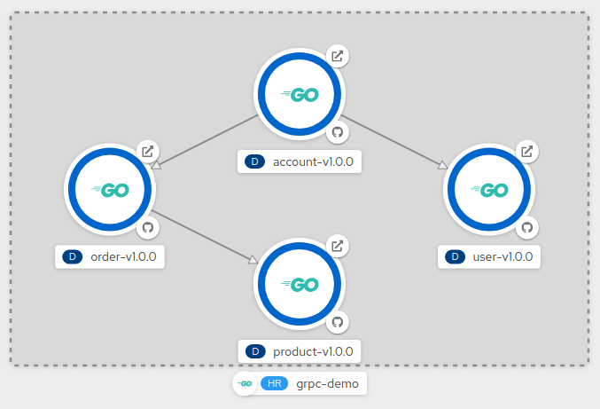
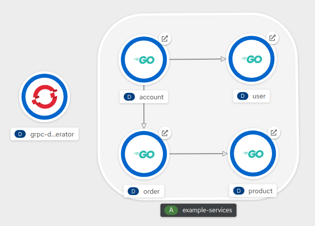
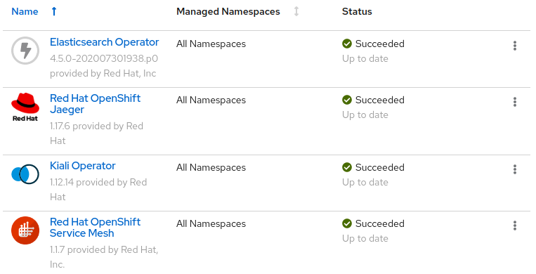
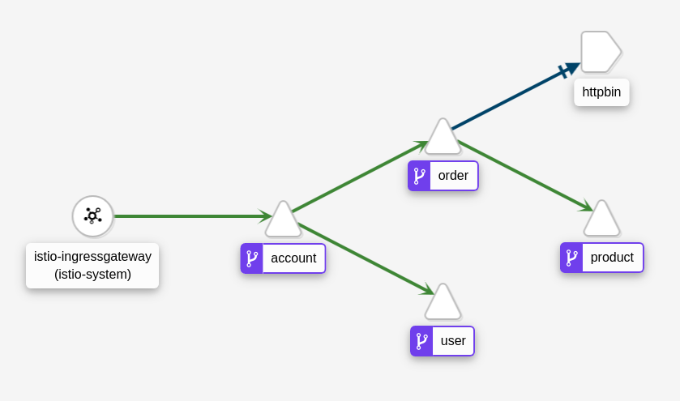

# Istio gRPC Services Demo

---

STILL IN DEVELOPMENT

---


This is a demo to showcase the features of some of the technologies that may be involved in modern microservice development and operation within a Kubernetes platform.

This technologies include [Go](https://golang.org/), [gRPC](https://grpc.io/), [Istio](https://istio.io/), [Helm](https://helm.sh/) and [Kubernetes Operators](https://kubernetes.io/docs/concepts/extend-kubernetes/operator/).

Note that this is just a demo and may not represent the real life. Technologies are mixed but they may not be used all at once. Hopefully it could help you to understand basic concepts that may be the building blocks to create more complex gRPC microservices in a service mesh.

For deployment, three different mechanisms are provided. You can also choose wether you use Istio or not.

All the examples are provided for Red Hat OpenShift but could be applied to any Kubernetes distribution. If you want to run OpenShift on your laptop you may want to try [Red Hat CodeReady Containers](https://developers.redhat.com/products/codeready-containers/overview).

## Index

1. [Architecture](#1---architecture)
2. [Writing gRPC services in Go](#2---writing-grpc-services-in-go)
3. [Creating a Helm chart for deploying services](#3---creating-a-helm-chart-for-deploying-services)
4. [Creating an OpenShift Template for deploying services](#4---creating-an-openshift-template-for-deploying-services)
5. [Creating a Kubernetes Operator for deploying services](#5---creating-a-kubernetes-operator-for-deploying-services)
6. [Installing Istio Service Mesh in OpenShift](#6---installing-istio-service-mesh-in-openshift)
7. [Deploying the demo services using Istio](#7---deploying-the-demo-services-using-istio)
8. [Deploying the demo services without using Istio](#8---deploying-the-demo-services-without-using-istio)
9. [Observability with Kiali](#9---observability-with-kiali)

## 1 - Architecture


This demo is composed of four microservices modeling how a customer buy products in an eCommerce:

- [Account](https://github.com/drhelius/grpc-demo-account): Models a user account. The user can have many orders in it. The account also has a reference to user information.
- [Order](https://github.com/drhelius/grpc-demo-order): This is a group of products ordered by the user.
- [User](https://github.com/drhelius/grpc-demo-user): The user personal information.
- [Product](https://github.com/drhelius/grpc-demo-product): A description of a product in the store including price an details.

All four microservices are written in go using gRPC as the main communication framework. Additionally, an HTTP (REST) listener is also provided for each of them.

The demo can be setup using Istio or without using it.

Three deployment methods are provided for demonstration purposes, you are not expected to use them all at once:

- Helm Chart
- OpenShift Template
- Kubernetes Operator

Note that, for simplicity, the operator is only provided for deploying the demo microservices without Istio.

## 2 - Writing gRPC services in Go

TODO

## 3 - Creating a Helm chart for deploying services



TODO

`helm package helm-charts/grpc-demo-services`

`helm package helm-charts/grpc-demo-services-istio`

`helm repo index docs --url https://drhelius.github.io/grpc-demo/`

`helm fetch grpc-demo/grpc-demo-services`

## 4 - Creating an OpenShift Template for deploying services

OpenShift templates are not available in other Kubernetes distributions but they are very convenient for simple deployments if you are working with OpenShift.

These templates can be parameterized but the lack of dynamism (loops and conditionals) usually makes Helm a better option. Refer to the [official docs](https://docs.openshift.com/container-platform/4.5/openshift_images/using-templates.html) for additional information.


Two templates are provided in this repo for deploying the demo services both with Istio and without it:

- [grpc-demo-template-istio.yaml](openshift-templates/grpc-demo-template-istio.yaml)
- [grpc-demo-template.yaml](openshift-templates/grpc-demo-template.yaml)

These templates define all the manifests needed in order to get the services deployed and working.

The parameters allow you to configure the services image, version, replicas and resources.

The `APP_NAME` parameter is just an identifier to label all the manifests created by the templates and organize the view in the OpenShift Developer Console.

The `grpc-demo-template-istio.yaml` template expects an additional `ACCOUNT_ROUTE` parameter to expose the Account service using an [Ingress Gateway](https://istio.io/latest/docs/tasks/traffic-management/ingress/ingress-control/). Make sure to provide a valid *fqdn* for this route that makes sense in your cluster. The default value `account-grpc-demo.mycluster.com` is just a placeholder and will not work out of the box.

## 5 - Creating a Kubernetes Operator for deploying services



TODO

https://developers.redhat.com/books/kubernetes-operators
https://sdk.operatorframework.io/

## 6 - Installing Istio Service Mesh in OpenShift

In order to install OpenShift Service Mesh you should go through the steps explained in the [official docs](https://docs.openshift.com/container-platform/4.5/service_mesh/service_mesh_install/preparing-ossm-installation.html). The following is a simplified guide.

Istio in OpenShift is installed by running a set of operators. Before installing the Red Hat Service Mesh operator you have to install the Elasticsearch, Jaeger and Kiali operators, in this order.



### Install Elasticsearch Operator

- Update Channel: 4.5
- Installation Mode: All namespaces
- Installed Namespace: openshift-operators
- Approval Strategy: Automatic

### Install Red Hat OpenShift Jaeger Operator

- Update Channel: stable
- Installation Mode: All namespaces
- Installed Namespace: openshift-operators
- Approval Strategy: Automatic

### Install Kiali Operator (provided by Red Hat)

- Update Channel: stable
- Installation Mode: All namespaces
- Installed Namespace: openshift-operators
- Approval Strategy: Automatic

### Install Red Hat OpenShift Service Mesh operator

- Update Channel: stable
- Installation Mode: All namespaces
- Installed Namespace: openshift-operators
- Approval Strategy: Automatic

### Create istio-system project

With all four required operators installed in your cluster you are ready to deploy Istio.

First create a namespace for the control plane, the name `istio-system` is recommended:

`$ oc new-project istio-system`

### Deploy Service Mesh control plane

Once the project is ready you can create the control plane.

A Service Mesh Control Plane manifest is [provided in this repo](openshift-service-mesh/service-mesh-control-plane.yaml). Use it to bootstrap the installation of Istio in OpenShift:

`$ oc create -f openshift-service-mesh/service-mesh-control-plane.yaml -n istio-system`

Istio operator will then create all the deployments that conform the control plane. After a few minutes it should look like this:

```bash
$ oc get deployments -n istio-system
NAME                     READY   UP-TO-DATE   AVAILABLE   AGE
grafana                  1/1     1            1           41d
ior                      1/1     1            1           41d
istio-citadel            1/1     1            1           41d
istio-egressgateway      1/1     1            1           41d
istio-galley             1/1     1            1           41d
istio-ingressgateway     1/1     1            1           41d
istio-pilot              1/1     1            1           41d
istio-policy             1/1     1            1           41d
istio-sidecar-injector   1/1     1            1           41d
istio-telemetry          1/1     1            1           41d
jaeger                   1/1     1            1           41d
kiali                    1/1     1            1           15d
prometheus               1/1     1            1           41d
```

## 7 - Deploying the demo services using Istio

Two methods are provided to deploy the demo services and setup the service mesh:

- Helm Chart
- OpenShift Template

But first you need to create a namespace for the services and tell Istio to start monitoring this namespace by adding it to the [Member Roll](https://docs.openshift.com/container-platform/4.5/service_mesh/service_mesh_install/installing-ossm.html#ossm-member-roll-create_installing-ossm).

### Create a project to deploy the demo services

`$ oc new-project grpc-demo-istio`

### Create the service mesh member roll

A Service Mesh Member Roll manifest is [provided in this repo](openshift-service-mesh/service-mesh-member-roll.yaml). It includes the `grpc-demo-istio` project just created. If you are using a different name for the project you should change it accordingly.

Use it to create the Member Roll:

`$ oc create -f openshift-service-mesh/service-mesh-member-roll.yaml -n istio-system`

### Deploy the services using a Helm Chart

If you wish to use the [provided Helm chart](helm-charts/grpc-demo-services-istio/Chart.yaml) to deploy the demo services and all required manifests follow this steps.

Make sure you are working with the right namespace:

`$ oc project grpc-demo-istio`

Add the chart repository to your helm client and name it `grpc-demo`:

```bash

$ helm repo add grpc-demo https://drhelius.github.io/grpc-demo/
"grpc-demo" has been added to your repositories

$ helm repo list
NAME        URL
grpc-demo   https://drhelius.github.io/grpc-demo/
```

Make sure you get the latest list of charts:

```bash
$ helm repo update
Hang tight while we grab the latest from your chart repositories...
...Successfully got an update from the "grpc-demo" chart repository
Update Complete. ⎈ Happy Helming!⎈
```

The chart you are going to install is called `grpc-demo-services-istio`. You can inspect the chart before installing it in your cluster:

```bash
$ helm show chart grpc-demo/grpc-demo-services-istio
apiVersion: v2
description: A group of interconnected GRPC demo services written in Go that run on
  OpenShift Service Mesh.
home: https://github.com/drhelius/grpc-demo
icon: https://raw.githubusercontent.com/openshift/console/master/frontend/public/imgs/logos/golang.svg
keywords:
- go
- grpc
- demo
- service
- istio
maintainers:
- email: isanchez@redhat.com
  name: Ignacio Sánchez
  url: https://twitter.com/drhelius
name: grpc-demo-services-istio
sources:
- https://github.com/drhelius/grpc-demo
version: 1.0.0
```

The chart can be parameterized. These are the [default values](helm-charts/grpc-demo-services-istio/values.yaml) for all the parameters:

```yaml
appName: grpc-demo-istio

account:
  image: quay.io/isanchez/grpc-demo-account
  version: v1.0.0
  replicas: 1
  route: account-grpc-demo.mycluster.com

order:
  image: quay.io/isanchez/grpc-demo-order
  version: v1.0.0
  replicas: 1

product:
  image: quay.io/isanchez/grpc-demo-product
  version: v1.0.0
  replicas: 1

user:
  image: quay.io/isanchez/grpc-demo-user
  version: v1.0.0
  replicas: 1

limits:
  memory: "200"
  cpu: "0.5"

requests:
  memory: "100"
  cpu: "0.1"
```

Note that you must provide a valid *fqdn* for the route that is going to expose the Account service HTTP listener using an Ingress Gateway. This *fqdn* should make sense in your cluster so change `account-grpc-demo.mycluster.com` for a route valid in your cluster.

Install the chart using a custom Account route:

`$ helm install --set account.route=account-grpc-demo.mycluster.com grpc-demo-istio grpc-demo/grpc-demo-services-istio`

After a few minutes the services should be up an running:

```bash
$ oc get deployments
NAME             READY   UP-TO-DATE   AVAILABLE   AGE
account-v1.0.0   1/1     1            1           3m1s
order-v1.0.0     1/1     1            1           3m1s
product-v1.0.0   1/1     1            1           3m1s
user-v1.0.0      1/1     1            1           3m1s
```

You can test the services using HTTP by sending a GET request to the Account service (any account ID will do). For simplicity, the starting request will be HTTP but all subsequent requests between services will be GRPC:

`$ curl http://account-grpc-demo.mycluster.com/v1/account/01234`

You can uninstall everything deployed by running:

`$ helm uninstall grpc-demo-istio`

### Deploy the services using an OpenShift template

If you wish to use the [provided OpenShift template](openshift-templates/grpc-demo-template-istio.yaml) to deploy the demo services and all required manifests follow this steps.

Make sure you are working with the right namespace:

`$ oc project grpc-demo-istio`

Add the template to your project:

```bash
$ oc create -f openshift-templates/grpc-demo-template-istio.yaml
template.template.openshift.io/grpc-demo-istio created

$ oc get template
NAME              DESCRIPTION                                                                        PARAMETERS     OBJECTS
grpc-demo-istio   A group of interconnected GRPC demo services written in Go that run on OpenSh...   18 (all set)   22
```

This template expects a parameter named `ACCOUNT_ROUTE` to expose the Account service using an [Ingress Gateway](https://istio.io/latest/docs/tasks/traffic-management/ingress/ingress-control/). Make sure to provide a valid *fqdn* for this route that makes sense in your cluster. The default value `account-grpc-demo.mycluster.com` is just a placeholder and will not work out of the box.

You can now use the Web Console to create all the services using this template:

You can also use the cli:

```bash
$ oc process -f openshift-templates/grpc-demo-template-istio.yaml -p ACCOUNT_ROUTE=account-grpc-demo.mycluster.com | oc create -f -
deployment.apps/account-v1.0.0 created
service/account created
virtualservice.networking.istio.io/account created
destinationrule.networking.istio.io/account created
gateway.networking.istio.io/account created
virtualservice.networking.istio.io/account-gateway created
deployment.apps/order-v1.0.0 created
service/order created
virtualservice.networking.istio.io/order created
destinationrule.networking.istio.io/order created
deployment.apps/product-v1.0.0 created
service/product created
virtualservice.networking.istio.io/product created
destinationrule.networking.istio.io/product created
deployment.apps/user-v1.0.0 created
service/user created
virtualservice.networking.istio.io/user created
destinationrule.networking.istio.io/user created
serviceentry.networking.istio.io/httpbin created
gateway.networking.istio.io/httpbin created
destinationrule.networking.istio.io/httpbin created
virtualservice.networking.istio.io/httpbin created
```

After a few minutes the services should be up an running:

```bash
$ oc get deployments
NAME             READY   UP-TO-DATE   AVAILABLE   AGE
account-v1.0.0   1/1     1            1           3m1s
order-v1.0.0     1/1     1            1           3m1s
product-v1.0.0   1/1     1            1           3m1s
user-v1.0.0      1/1     1            1           3m1s
```

You can test the services using HTTP by sending a GET request to the Account service (any account ID will do). For simplicity, the starting request will be HTTP but all subsequent requests between services will be GRPC:

`$ curl http://account-grpc-demo.mycluster.com/v1/account/01234`

You can uninstall everything deployed by running:

`$ oc process -f openshift-templates/grpc-demo-template-istio.yaml | oc delete -f -`

## 8 - Deploying the demo services without using Istio

Three methods are provided to deploy the demo services without using a service mesh:

- Helm Chart
- OpenShift Template
- Kubernetes Operator

You can have the demo services deployed both with Istio and without it at the same time but, for simplicity, you may want to deploy them in a different namespace.

### Create a project to deploy the demo services

`$ oc new-project grpc-demo`

### Deploy the services using a Helm Chart

If you wish to use the [provided Helm chart](helm-charts/grpc-demo-services/Chart.yaml) to deploy the demo services and all required manifests follow this steps.

Make sure you are working with the right namespace:

`$ oc project grpc-demo`

Add the chart repository to your helm client and name it `grpc-demo`:

```bash

$ helm repo add grpc-demo https://drhelius.github.io/grpc-demo/
"grpc-demo" has been added to your repositories

$ helm repo list
NAME        URL
grpc-demo   https://drhelius.github.io/grpc-demo/
```

Make sure you get the latest list of charts:

```bash
$ helm repo update
Hang tight while we grab the latest from your chart repositories...
...Successfully got an update from the "grpc-demo" chart repository
Update Complete. ⎈ Happy Helming!⎈
```

The chart you are going to install is called `grpc-demo-services`. You can inspect the chart before installing it in your cluster:

```bash
$ helm show chart grpc-demo/grpc-demo-services
apiVersion: v2
description: A group of interconnected GRPC demo services written in Go.
home: https://github.com/drhelius/grpc-demo
icon: https://raw.githubusercontent.com/openshift/console/master/frontend/public/imgs/logos/golang.svg
keywords:
- go
- grpc
- demo
- service
maintainers:
- email: isanchez@redhat.com
  name: Ignacio Sánchez
  url: https://twitter.com/drhelius
name: grpc-demo-services
sources:
- https://github.com/drhelius/grpc-demo
version: 1.0.0
```

The chart can be parameterized. These are the [default values](helm-charts/grpc-demo-services/values.yaml) for all the parameters:

```yaml
appName: grpc-demo

account:
  image: quay.io/isanchez/grpc-demo-account
  version: v1.0.0
  replicas: 1

order:
  image: quay.io/isanchez/grpc-demo-order
  version: v1.0.0
  replicas: 1

product:
  image: quay.io/isanchez/grpc-demo-product
  version: v1.0.0
  replicas: 1

user:
  image: quay.io/isanchez/grpc-demo-user
  version: v1.0.0
  replicas: 1

limits:
  memory: "200"
  cpu: "0.5"

requests:
  memory: "100"
  cpu: "0.1"
```

Install the chart:

`$ helm install grpc-demo grpc-demo/grpc-demo-services`

After a few minutes the services should be up an running:

```bash
$ oc get deployments
NAME             READY   UP-TO-DATE   AVAILABLE   AGE
account-v1.0.0   1/1     1            1           3m1s
order-v1.0.0     1/1     1            1           3m1s
product-v1.0.0   1/1     1            1           3m1s
user-v1.0.0      1/1     1            1           3m1s
```

An HTTP route for every service is automatically created:

```bash
$ oc get route
NAME      HOST/PORT                                           PATH   SERVICES   PORT   TERMINATION   WILDCARD
account   account-grpc-demo.apps.mycluster.com                 account    http                 None
order     order-grpc-demo.apps.mycluster.com                   order      http                 None
product   product-grpc-demo.apps.mycluster.com                 product    http                 None
user      user-grpc-demo.apps.mycluster.com                    user       http                 None
```

You can test the services using HTTP by sending a GET request to the Account service (any account ID will do). For simplicity, the starting request will be HTTP but all subsequent requests between services will be GRPC:

`$ curl http://account-grpc-demo.apps.mycluster.com/v1/account/01234`

You can uninstall everything deployed by running:

`$ helm uninstall grpc-demo`

### Deploy the services using an OpenShift template

If you wish to use the [provided OpenShift template](openshift-templates/grpc-demo-template.yaml) to deploy the demo services and all required manifests follow this steps.

Make sure you are working with the right namespace:

`$ oc project grpc-demo`

Add the template to your project:

```bash
$ oc create -f openshift-templates/grpc-demo-template.yaml
template.template.openshift.io/grpc-demo created

$ oc get template
NAME        DESCRIPTION                                                   PARAMETERS     OBJECTS
grpc-demo   A group of interconnected GRPC demo services written in Go.   17 (all set)   12
```

You can now use the Web Console to create all the services using this template:

You can also use the cli:

```bash
$ oc process -f openshift-templates/grpc-demo-template.yaml | oc create -f -
deployment.apps/account-v1.0.0 created
service/account created
route.route.openshift.io/account created
deployment.apps/order-v1.0.0 created
service/order created
route.route.openshift.io/order created
deployment.apps/product-v1.0.0 created
service/product created
route.route.openshift.io/product created
deployment.apps/user-v1.0.0 created
service/user created
route.route.openshift.io/user created
```

After a few minutes the services should be up an running:

```bash
$ oc get deployments
NAME             READY   UP-TO-DATE   AVAILABLE   AGE
account-v1.0.0   1/1     1            1           43s
order-v1.0.0     1/1     1            1           42s
product-v1.0.0   1/1     1            1           42s
user-v1.0.0      1/1     1            1           41s
```

An HTTP route for every service is automatically created:

```bash
$ oc get route
NAME      HOST/PORT                                           PATH   SERVICES   PORT   TERMINATION   WILDCARD
account   account-grpc-demo.apps.mycluster.com                 account    http                 None
order     order-grpc-demo.apps.mycluster.com                   order      http                 None
product   product-grpc-demo.apps.mycluster.com                 product    http                 None
user      user-grpc-demo.apps.mycluster.com                    user       http                 None
```

You can test the services using HTTP by sending a GET request to the Account service (any account ID will do). For simplicity, the starting request will be HTTP but all subsequent requests between services will be GRPC:

`$ curl http://account-grpc-demo.apps.mycluster.com/v1/account/01234`

You can uninstall everything deployed by running:

`$ oc process -f openshift-templates/grpc-demo-template-istio.yaml | oc delete -f -`

### Deploy the services using a Kubernetes Operator

If you wish to use the [provided Kubernetes Operator](https://github.com/drhelius/grpc-demo-operator) to deploy the demo services and all required manifests follow this steps.

First clone the operator repository:

```bash
$ git clone https://github.com/drhelius/grpc-demo-operator.git
$ cd grpc-demo-operator
```

Make sure you are working with the right namespace:

`$ oc project grpc-demo`

The repository you just cloned has a [Makefile](https://github.com/drhelius/grpc-demo-operator/blob/master/Makefile) to assist in some operations.

Run this to deploy the operator, CRDs and required configuration:

```bash
$ make setup
kubectl apply -f deploy/crds/grpcdemo.example.com_services_crd.yaml
customresourcedefinition.apiextensions.k8s.io/services.grpcdemo.example.com created
kubectl apply -f deploy/service_account.yaml
serviceaccount/grpc-demo-operator created
kubectl apply -f deploy/role.yaml
role.rbac.authorization.k8s.io/grpc-demo-operator created
kubectl apply -f deploy/role_binding.yaml
rolebinding.rbac.authorization.k8s.io/grpc-demo-operator created
kubectl apply -f deploy/operator.yaml
deployment.apps/grpc-demo-operator created
```

Make sure the operator is running fine:

```bash
$ oc get deployment grpc-demo-operator
NAME                 READY   UP-TO-DATE   AVAILABLE   AGE
grpc-demo-operator   1/1     1            1           2m56s
```

The operator is watching custom resources with kind `services.grpcdemo.example.com`.

Now you can create your own [custom resource](https://github.com/drhelius/grpc-demo-operator/blob/master/deploy/crds/example_cr.yaml) to instruct the operator to create the demo services:

```yaml
apiVersion: grpcdemo.example.com/v1
kind: Services
metadata:
  name: example-services
spec:
  services:
    - name: account
      image: quay.io/isanchez/grpc-demo-account
      version: v1.0.0
      replicas: 1
      limits:
        memory: 200Mi
        cpu: "0.5"
      requests:
        memory: 100Mi
        cpu: "0.1"
    - name: order
      image: quay.io/isanchez/grpc-demo-order
      version: v1.0.0
      replicas: 1
      limits:
        memory: 200Mi
        cpu: "0.5"
      requests:
        memory: 100Mi
        cpu: "0.1"
    - name: product
      image: quay.io/isanchez/grpc-demo-product
      version: v1.0.0
      replicas: 1
      limits:
        memory: 200Mi
        cpu: "0.5"
      requests:
        memory: 100Mi
        cpu: "0.1"
    - name: user
      image: quay.io/isanchez/grpc-demo-user
      version: v1.0.0
      replicas: 1
      limits:
        memory: 200Mi
        cpu: "0.5"
      requests:
        memory: 100Mi
        cpu: "0.1"
```

Create the custom resource by using the provided example:

```bash
$ oc create -f deploy/crds/example_cr.yaml
services.grpcdemo.example.com/example-services created
```

After a few minutes the operator should have created all the required objects and the services should be up an running:

```bash
$ oc get deployment
NAME                 READY   UP-TO-DATE   AVAILABLE   AGE
account              1/1     1            1           2m14s
grpc-demo-operator   1/1     1            1           14m
order                1/1     1            1           2m14s
product              1/1     1            1           2m13s
user                 1/1     1            1           2m13s
```

An HTTP route for every service is automatically created:

```bash
$ oc get route
NAME      HOST/PORT                                     PATH   SERVICES   PORT   TERMINATION   WILDCARD
account   account-grpc-demo.apps.mycluster.com                 account    http                 None
order     order-grpc-demo.apps.mycluster.com                   order      http                 None
product   product-grpc-demo.apps.mycluster.com                 product    http                 None
user      user-grpc-demo.apps.mycluster.com                    user       http                 None
```

You can test the services using HTTP by sending a GET request to the Account service (any account ID will do). For simplicity, the starting request will be HTTP but all subsequent requests between services will be GRPC:

`$ curl http://account-grpc-demo.apps.mycluster.com/v1/account/01234`

You can uninstall the services by deleting the custom resource and the operator will delete all of them for you:

```bash
$ oc delete services.grpcdemo.example.com example-services
services.grpcdemo.example.com "example-services" deleted
```

## 9 - Observability with Kiali



